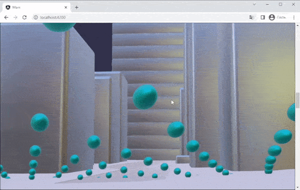

# MoveCameraByPointer

MoveCameraByPointer is a behavior for Babylon.js that allows you to move the camera by pointer.



## Installation

To install MoveCameraByPointer, simply run:

```bash
npm install move-camera-by-pointer
```

## Usage

Here's an example of how to use MoveCameraByPointer:

```ts
import { MoveCameraByPointer } from 'move-camera-by-pointer';
import { SceneLoader } from '@babylonjs/core';

// Import our scene with animated camera
SceneLoader.Append('/assets/', 'myScene.gltf', this.scene, scene => {
  // Find last camera in scene
  const myCam = scene.cameras[scene.cameras.length - 1];

  if (myCam) {
    // If camera exists, make it active
    scene.activeCamera = myCam;

    // Attach behavior to camera
    const moveCameraByPointer = new MoveCameraByPointer();
    myCam.addBehavior(moveCameraByPointer);
  }
});
```

And you can customize the behavior by passing in an options object:

```ts
const moveCameraByPointer = new MoveCameraByPointer({
  directionForces: [1, 0.5],
  pointerElement: document.getElementById('scrollable')!,
  onBeforeUpdate: ([forceX, forceY]) => {
    return [forceX * 1.1, forceY * 0.8];
  }
});
myCam.addBehavior(moveCameraByPointer);
```

## Options

- `directionForces` - The force of the pointer in each direction (`[number, number]`) or both (`number`). Defaults to `1`.
- `pointerElement` - The element to listen pointermove events on. Defaults to `window`.
- `onBeforeUpdate` - A function that is called before the node is updated. This function is passed the progress value and should return the progress value to use.

## Contributing

Contributions are welcome! If you'd like to contribute to this project, please follow the standard Gitflow workflow and submit a pull request.

## Relative resources

- [Babylon.js](https://www.babylonjs.com/)
- [Behaviors](https://doc.babylonjs.com/features/featuresDeepDive/behaviors)
- [Interesting examples of BabylonJS usage](https://yuka.babylonpress.org/examples/)
